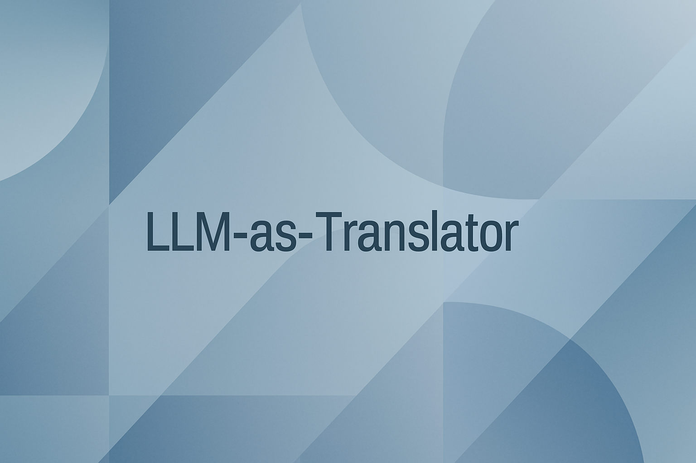

<!-- markdownlint-disable md033 md041 -->


# LLM-as-Translator

A simple and flexible Python-based translator using chat models to translate text between user-configured source and target languages. Supports both command-line interactive use and direct programmatic integration.

## Features

- Translate text between any two languages by specifying source and target languages.
- Interactive CLI with commands to change languages on the fly and clean exit support.
- Keeps a configurable history of recent translations in memory.
- Uses chat models from langchain for flexible, high-quality translation.
- Environment-variable support for API key management.
- Graceful handling of user interrupts (Ctrl+C).
- Command-line arguments for instant translation or interactive mode.

## Installation

```bash
git clone https://github.com/hnthap/llm-as-translator
cd llm-as-translator

# You are recommended to create an environment before installing anything
# to avoid conflicts.
pip install -r requirements.txt
```

Before running, set your Google Gemini API key in `.env` or input it at runtime if not preset. Read `.env.example` to know the expected format for `.env`.

## Usage

### Run interactively

```bash
python translator.py
```

Follow on-screen instructions to translate text or update source/target languages with commands:

- `\source <language>` — change the source language.
- `\target <language>` — change the target language.
- `\exit` — exit the CLI.

### Translate via CLI arguments

```bash
python translator.py English French --text "One hundred years in the human realm"
```

Translate from English to French, returning the result immediately.

## Configuration

- `source_language` and `target_language` (required): Set the languages for translation.
- `model` (optional): Model identifier (default: `gemini-2.5-flash`).
- `model_provider` (optional): Model provider (default: `google_genai`).
- `max_history`: Number of recent translations saved (default: 100).

## Planned Improvements

Search for `TODO` inside `translator.py` to read planned improvements.

## Testing

Unit and integration tests are in progress.

## License

Licensed under MIT License. See [LICENSE](./LICENSE) for more.

***

For detailed usage, examples, and development notes, see the code inline documentation.
